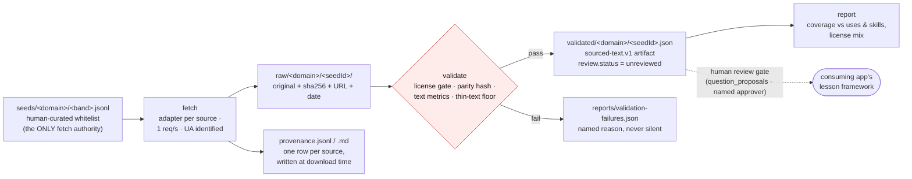

# Content Engine — a content **sourcing** engine

**It pulls source texts; it does not write lessons.** Seeded lists of public
sources come in — public-domain speeches and essays, US federal documents,
CC BY open textbooks — and the engine fetches them, verifies the license,
stamps full provenance at download time, measures the text, and emits
review-ready artifacts shaped for a lesson framework. The "content" it
produces is candidates for human review, never student-facing material.

The content-side twin of [writing-engine](https://github.com/supe-log/writing-engine):
that engine proves an assessment is trustworthy before it grades; this one
proves a text is *shippable* before it is allowed to exist in the pipeline.

Three parts, one discipline:

1. **Seeded acquisition** — whitelist, never crawl. The engine fetches only
   what a human put in a seed manifest, one document per seed, ~1 request per
   second, identified User-Agent. "Comprehensive" means comprehensive coverage
   of the curriculum spec, not bulk scraping.
2. **The license gate** — closed by default. Five shippable licenses exist;
   NonCommercial and "unknown" are **unrepresentable** — a seed carrying them
   cannot validate, so unlicensed text cannot flow downstream by accident.
3. **Provenance + parity** — every source gets a provenance row at download
   time (URL, license + rationale, retrieval date, sha256), validation
   re-hashes the text against that record so silent hand-edits are impossible,
   and every artifact ships `review: {status: "unreviewed"}` — nothing is
   promotable without a named human decision.

> Zero dependencies, zero keys: stdlib-only Python 3. The whole pipeline is
> three commands. Everything below is real output from the first live run
> (2026-09-15), not a mock.

---

## The pipeline



## Quick start

Requires Python 3.10+. No API keys, no installs.

```bash
python3 engine/engine.py fetch    --domain ela-writing   # pull everything seeded
python3 engine/engine.py validate --domain ela-writing   # license gate + metrics
python3 engine/engine.py report                          # coverage report
```

Useful flags: `--band g11-12-ap-lang` (one grade band), `--only <seedId>`
(one seed), `--force` (refetch).

## What a run looks like

First live run, 10 starter seeds for `ela-writing / g11-12-ap-lang`:

```
$ python3 engine/engine.py fetch --domain ela-writing
10 seed(s) selected
ok    swift-modest-proposal: 3420 words, sha c99823e64f2b
ok    thoreau-civil-disobedience: 9354 words, sha 28b00a18a7c1
ok    douglass-narrative: 40750 words, sha 4ef9c36d2c4d
ok    dubois-souls: 68628 words, sha 9e2bcd1d4ae9
ok    stanton-declaration-sentiments: 1124 words, sha 0220e27b6fe4
ok    douglass-what-to-the-slave: 10529 words, sha 9650dc730ba9
ok    lincoln-second-inaugural: 815 words, sha 1a6a8b5caa3c
ok    eisenhower-farewell: 1831 words, sha 45b47ff1208e
ok    kennedy-inaugural: 1341 words, sha 98f6d8aa19d1
ok    openstax-wgwh-rhetorical-analysis-intro: 604 words, sha e4999963b16a

$ python3 engine/engine.py validate --domain ela-writing
ok    swift-modest-proposal: 3420w, FK 21.1, needs excerpting
ok    lincoln-second-inaugural: 717w, FK 11.7
ok    eisenhower-farewell: 1831w, FK 13.2, needs excerpting
...
10 validated, 0 failed → validated/ + reports/validation-failures.json
```

And the coverage report (`reports/coverage-2026-09-15.md`, committed):

| seed | use | words | FK | license | skills |
|---|---|---|---|---|---|
| douglass-narrative | passage | 40750 | 8.9 | public-domain-pre1931 | rhetorical-analysis |
| douglass-what-to-the-slave | passage | 10391 | 10.4 | public-domain-pre1931 | rhetorical-analysis |
| dubois-souls | passage | 68628 | 12.5 | public-domain-pre1931 | rhetorical-analysis, argument |
| eisenhower-farewell | passage | 1831 | 13.2 | public-domain-us-gov | rhetorical-analysis, synthesis |
| kennedy-inaugural | passage | 1341 | 11.1 | public-domain-us-gov | rhetorical-analysis |
| lincoln-second-inaugural | passage | 717 | 11.7 | public-domain-pre1931 | rhetorical-analysis |
| openstax-wgwh-rhetorical-analysis-intro | instructional | 604 | 15.6 | cc-by-4.0 | rhetorical-analysis |
| stanton-declaration-sentiments | passage | 1073 | 14.7 | public-domain-pre1931 | rhetorical-analysis, argument |
| swift-modest-proposal | passage | 3420 | 21.1 | public-domain-pre1931 | rhetorical-analysis, satire-irony |
| thoreau-civil-disobedience | passage | 9354 | 12.7 | public-domain-pre1931 | rhetorical-analysis, argument |

## What an artifact looks like

Every validated source is one self-contained JSON file (`sourced-text.v1`).
Lincoln's Second Inaugural, abridged:

```json
{
  "schema": "sourced-text.v1",
  "seedId": "lincoln-second-inaugural",
  "title": "Second Inaugural Address",
  "author": "Abraham Lincoln",
  "year": 1865,
  "domain": "ela-writing",
  "gradeBand": "g11-12-ap-lang",
  "targetUse": "passage",
  "skills": ["rhetorical-analysis"],
  "landingShapes": ["passage_box", "annotated_passage", "source_texts"],
  "provenance": {
    "source": "wikisource",
    "sourceRef": "Abraham Lincoln's Second Inaugural Address",
    "urlUsed": "https://en.wikisource.org/wiki/Abraham_Lincoln%27s_Second_Inaugural_Address",
    "sha256": "1a6a8b5caa3c680fb2fd56873a86cefccd8fcf3f73bbac9241e59592e0a1b231",
    "retrievedAt": "2026-09-15T15:58:06Z",
    "license": "public-domain-pre1931",
    "licenseRationale": "Delivered 1865; US federal work and pre-1931"
  },
  "metrics": {
    "wordCount": 717,
    "sentenceCount": 35,
    "fleschKincaidGrade": 11.7,
    "excerptRequired": false
  },
  "text": "Fellow-countrymen: At this second appearing to take the oath ...",
  "review": { "status": "unreviewed" }
}
```

`landingShapes` names where the text can land in the consuming lesson
framework (a passage box, a role-annotated model passage, the source-text set
a judge panel verifies quotations against, topic fact bullets, adapted
instructional prose, a synthesis source, vocabulary terms) — so every pull
already knows what it is *for*.

## The license gate (plain-English)

The whole point of the engine is that this table is enforced in code, not in
a policy doc. `validate` refuses anything outside it, by name:

| License | What it demands | Why it's safe to ship |
|---|---|---|
| `public-domain-pre1931` | integer `year <= 1930`, rationale | US copyright has expired |
| `public-domain-us-gov` | `.gov`/`.mil` host for url fetches, rationale | US federal works are PD by statute (17 USC §105) |
| `public-domain-expired` | explicit rationale | for cases the year rule can't express |
| `cc-by-4.0` | an attribution string (surfaced wherever the text ships) | attribution is the entire obligation |
| `licensed-explicit` | a pointer to where the license lives | someone actually granted it |

**What is deliberately missing:** `cc-by-nc` and `unknown`. NonCommercial
content is unsafe inside tuition-funded schooling and poison for any later
commercial release, so it cannot be expressed at all — the failure happens at
the seed, loudly, not in a courtroom later. Publisher and testing-org
content (College Board FRQs, prep books) never enters this repository in any
form; College Board's terms additionally prohibit using their content with
generative AI, so it must also never appear in a generation prompt downstream.

Happily, the target canon barely needs any of that: rhetorical analysis lives
on Douglass, Thoreau, Lincoln, Swift, and Stanton — public domain — and
synthesis tasks live on federal reports and charts, public domain by statute.

## Seed manifests — the only fetch authority

One JSON object per line in `seeds/<domain>/<band>.jsonl`:

```json
{"seedId": "swift-modest-proposal", "source": "gutenberg", "sourceRef": "1080",
 "title": "A Modest Proposal", "author": "Jonathan Swift", "year": 1729,
 "license": "public-domain-pre1931", "licenseRationale": "First published 1729",
 "targetUse": "passage", "domain": "ela-writing", "gradeBand": "g11-12-ap-lang",
 "skills": ["rhetorical-analysis", "satire-irony"],
 "landingShapes": ["passage_box", "source_texts"]}
```

Adding a grade band or a whole new domain is a new manifest file — the engine
is generic. Optional per-seed fields: `attribution` (required for CC BY),
`textStart` / `textEnd` (human-set trim markers for pages whose site chrome
survives extraction; a marker that fails to match is a hard error, so a full
page can never silently masquerade as a trimmed transcript).

### Source adapters (and the traps already hit)

| Adapter | `sourceRef` | Hardening learned in the first run |
|---|---|---|
| `gutenberg` | ebook id | Fetches gutenberg.org directly (gutendex was down); verifies the seed title against the PG header **before** stripping boilerplate, so a wrong id fails loudly instead of shipping the wrong book; CRLF endings normalized before hashing or the parity check trips on re-read |
| `wikisource` | exact page title | Uses `action=parse`, **not** TextExtracts — extracts returns empty for Wikisource's transcluded proofread pages; records the revision id; strips `ws-header`/license-banner chrome by class; takes source text only (page annotations are CC BY-SA and not licensed here) |
| `url` | full URL | `.gov`/`.mil` host enforced when the claimed license is `public-domain-us-gov`; HTML reduced to text with class/id chrome stripping plus the `textStart`/`textEnd` markers |

## Repository layout

```
engine/engine.py     the whole engine: seeds → fetch → validate → report (stdlib only)
seeds/               per-domain, per-band manifests (the whitelist)
validated/           sourced-text.v1 artifacts — text + provenance + metrics, unreviewed
reports/             coverage reports per run
provenance.jsonl     machine provenance rows, one per source
provenance.md        the same table, human-readable, regenerated by the engine
raw/                 original fetches (local only, gitignored)
```

## Known limitations & next steps

- **Excerpting is not automated.** AP-style passages run 600–800 words; long
  works are flagged `excerptRequired` and excerpting stays a human/AI-assisted
  *reviewed* stage, because choosing the excerpt is a pedagogical decision.
- **Annotation is downstream.** `annotated_passage` (role-tagged sentences)
  and item generation happen after this engine, behind the same human review
  gate everything else uses.
- **HTML extraction is heuristic.** Stdlib parsing plus chrome-class stripping
  plus trim markers is honest but crude; a page with unusual chrome needs a
  `textStart`/`textEnd` pair. Every artifact is unreviewed by design, so
  extraction defects are caught by the reviewer, not by students.
- **One domain seeded so far** (`ela-writing / g11-12-ap-lang`, 10 sources).
  The engine is domain-generic; the canon lists are the curation work, and
  curating them is deliberately a human (subject-expert) task.
- **Readability is Flesch-Kincaid** via a syllable heuristic — a leveling
  *signal* for reviewers, not a claim.

## License

[MIT](LICENSE) © 2026 supe-log. The engine is MIT; each pulled text carries
its own license in its artifact's `provenance` block, which is the record to
trust.
